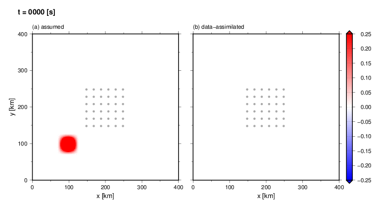

# TDAC: Tsunami Data Assimilation Code

* * *

## Description

This code assimilates tsunami wave field from observation of tsunami height at discrete stations. The package contains a synthetic example of the tsunami data assimilation. The theory, synthetic tests and an application are described in the following accompanying papers:

Maeda, T., K. Obara, M. Shinohara, T. Kanazawa, K. Uehira,
Successive estimation of a tsunami wavefield without earthquake source data: A data assimilation approach toward real-time tsunami forecasting,
_Geophys. Res. Lett._, _42_, 7923-7932, doi:[10.1002/2015GL065588](http://doi.org/10.1002/2015GL065588), 2015.

Gusman, A. R., A. F. Sheehan, K. Stake, M. Heidarzadeh, I. E. Mulia, and T. Maeda,
Tsunami data assimilation of high-density offshore pressure gauges off Cascade from the 2012 Haida Gwaii earthquake,
under review.

The authors request that the user to cite the accompanying papers in any publications that result from the use of this software, although this is not an obligation.

## License

MIT

## Languages

Fortran 2003

The author confirmed that it works fine with gfortran 5.3.0 on Mac OSX El Capitan.


## How to use

```bash
# compile the code
cd src
make

# execute
cd ..
./tdac.x

# visualize the assimilated wavefield (needs GMT5)
./src/plot.gmt5
```

### Example
The following animation shows the result obtained from the example code. Left and right panels show assumed and data-assimilated tsunami wavefield (wave height) at elapsed times shown on top. Dots at the center of panels show synthetic station locations. The data observed at these stations at every one second are used for data assimilation.


